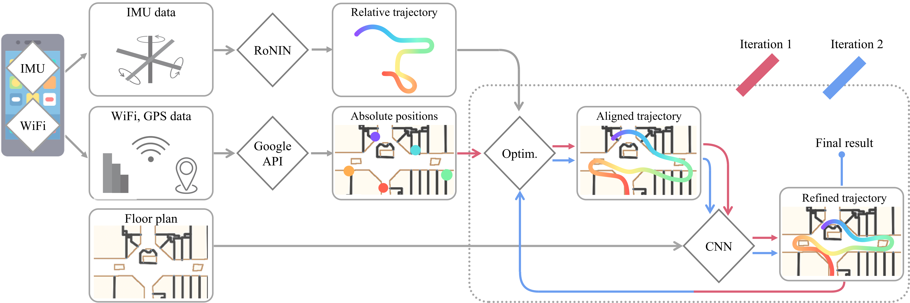

# Fusion_DHL
Paper: TBD

Video : https://youtu.be/CCDms7KWgI8



------------------

### Shared resources
* Test Dataset
    * [data](https://www.dropbox.com/sh/rylps4jy664i7qp/AAAcKuon7mVyIKoveOwQARHJa?dl=0)
    * [floorplans](https://www.dropbox.com/sh/gxbrp821gakp0n0/AAA97rQrkk5PTL6Dc_-QhAMXa?dl=0)
* [Pretrained model](https://www.dropbox.com/sh/nv6c0tgae9jiycg/AABb4NsrL3xcwLuOS3SXSMaJa?dl=0)
* Data collection apps
    * imu data recorder : [Sensor Data Logger](https://www.dropbox.com/s/n9gvmfty37mip9a/Sensor_Data_Logger.apk?dl=0)
    * manual location marking: Custom Maps [apk](https://www.dropbox.com/s/0kh8szjvpin78y3/Custom_Maps_minimal.apk?dl=0), [source](https://github.com/Sachini/custom-maps)

--------------------    
    
### Testing / Evaluation
1. Setup repository
    * Download test dataset, floorplans and pretrained model to `<data>`, `<floorplan>`, and `<model>` folders. 
    * Download this repository. Copy _source/sample_data_paths.json_ as _source/data_paths.json_ and specify default paths.
    * For next steps, we will show example commands for one test datafile. See relevant code for more configuration 
    options.
2. IMU and WiFi Fusion by Optimization
    * Run _source/optim/optimizer.py_ to geolocalize trajectory with floorplan
    * Sample command: `python optimizer.py --out_dir <optimize_out_dir> --data_path <data_folder_path> --loop --no_gui 
    --map_path <path_to_map_image> --map_latlong_path <path_to_csv_with_image_latlong_mapping>`
    * E.g. : `python optimizer.py --out_dir <output>/optim_s1 --data_path <data>/a001_d1_metrotown_0g --map_path 
    <floorplan>/metrotown_0g.png --loop --no_gui`
3. Floorplan fusion by CNN
    * Run _source/nn/nn_eval_full_traj.py_ for CNN prediction.
    * Sample command: `python nn_eval_full_traj.py --floorplan_dir <directory_with_floorplan_images> --floorplan_dpi 
    <floorplan_resolution> --input_dpi <resolution_suitable_for_network> --test_path <optimize_out_dir/data_folder> --out_dir <flow_out_dir> --model_path <fusion_dhl_cnn_checkpoint>`
    * E.g. : `python nn_eval_full_traj.py --floorplan_dir <floorplan> --test_path <output>/optim_s1/a001_d1_metrotown_0g 
    --out_dir <output>/flow_s1 --model_path <model>/ckpt_fusion_dhl_unet.pt`
4. Run second iteration of optimization with prediction of 2.
    * Run _source/optim/optimizer_with_flow.py_
    * Sample command: `python optimizer_with_flow.py --out_dir <optimize2_out_dir> --data_path <data_folder_path> --map_path <path_to_map_image> --result_dir <flow_out_dir> --loop --no_gui`
    * E.g.: `python optimizer_with_flow.py --out_dir <output>/optim_s2 --data_path <data>/a001_d1_metrotown_0g --map_path 
    <floorplan>/metrotown_0g.png --result_dir <output>/flow_s1/output/full_result --loop --no_gui`
5. Repeat step 2 with results of 3 as test path `--test_path <optimize2_out_dir/data_folder>`
    * E.g.: `python nn_eval_full_traj.py --floorplan_dir <floorplan> --test_path <output>/optim_s2/a001_d1_metrotown_0g 
    --out_dir <output>/flow_s2 --model_path <model>/ckpt_fusion_dhl_unet.pt`

----------------------------
### Using your own dataset

The data collection, pre-processing and training steps are listed below. After completion, run testing/evaluation 
steps with the relevant paths
    

#### Data collection
1. Create floorplan image according to the speicifed format and a known resolution. (Resolution must be chosen in such a way that cropped squares of size 250 by 250 pixel from the floorplan image have multiple rooms/corridors in them. The bigger the rooms, the smaller pixel/meter. We chose 2.5 pixels per meter for the shared dataset which are from shopping malls)
2. Install Custom Maps app from [apk](https://www.dropbox.com/s/0kh8szjvpin78y3/Custom_Maps_minimal.apk?dl=0) or 
[source](https://github.com/Sachini/custom-maps) and create map by aligning floorplan with google maps
    * During data collection, select map of current floorplan and manually click the current location at sparse points for evaluation.
3. Put floorplans for training set, and floorplans for test purpose in separate folders and copy _source/sample_map_info.json_ as _map_info.json_ in these folders and specify the floorplan and image names.
4. Install [Sensor Data Logger](https://www.dropbox.com/s/n9gvmfty37mip9a/Sensor_Data_Logger.apk?dl=0) app and click start service to record data
    * disable battery optimization for the app upon installation
    * location, WiFi and bluetooth needs to be switched on for data collection. 
5. Copy Sensor_Data_Logger output (in Downloads) to computer. Copy relevant Custom_Maps output files (in Downloads/mapLocalize) to a new folder named _map_ inside the copied folder.


#### Data Preprocessing
1. Download this repository. Copy _source/sample_data_paths.json_ as _source/data_paths.json_ and specify default paths.
2. Download RoNIN resnet model checkpoint from the [website](https://ronin.cs.sfu.ca/)
3. Run _source/preprocessing/compile_dataset.py_ to preprocess data into synced data streams and save as hdf5 files.
4. Generate synthetic data (for training CNN)
    * Run _source/gui/synthetic_data_generator.py_ to generate synthetic data by hand-drawing paths on a map
    * E.g. `python synthetic_data_generator.py <path_to_map_image> --map_dpi <pixels_per_meter> --out_dir <path_to_directory> --add_noise`
5. For training groundtruth, run _source/optim/optimizer_ with gui and manually specify constraints (if necessary) 
until the trajectory looks correct. (command in testing/evaluation)


#### Floorplan fusion by CNN
1. Preprocess training data:
    * run _source/nn/data_generator_train_real.py_ and _source/nn/data_generator_train_syn.py_ with mode argument to generate real and synthetic dataset suitable for training the Neural Network. Please refer to the source code for the full list of command line arguments. Change `_dpi` to the pixel per meter resolution of your floorplan image. 
    * Example command for real data generation: ```python3 data_generator_train_real.py --run_type 'full' --save_all_figs True --data_dir <path-to-real-data-folder> --datalist_file <path-to-list-of-real-data> --floorplans_dir <path-to-train-floorplans> --out_dir <path-to-output-real-dataset-folder>```.
    * Example command for synthetic data generation: ```python3 data_generator_train_syn.py --save_all_figs True --data_dir <path-to-synthetic-data-folder-for-specific-floorplan> --datalist_file <path-to-list-of-synthetic-data-for-specific-floorplan> --floorplans_dir <path-to-floorplans> --out_dir <path-to-output-synthetic-dataset-folder> --which_mall <name-of-the-specific-floorplan>```.
2. Training
    * Run _source/nn/nn_train.py_ to train or test the CNN. Please refer to the source code for the full list of command line arguments and their descriptions.
    * E.g. command for training: `python3 nn_train.py --real_floorplans <path_to_real_data's_floorplans> --real_train_list <path_to_real_train_data_list> --real_val_list <path_to_real_validation_data_list> --real_dataset <path_to_real_dataset_from_previous_part> --syn_floorplans <path_to_synthetic_data's_floorplans> --syn_train_list <path_to_synthetic_train_data_list> --syn_val_list <path_to_synthetic_validation_data_list> --syn_dataset <path_to_synthetic_dataset_from_previous_part> --out_dir <path_to_outputs> --mode 'train'`
    * E.g. command for testing: `python3 nn_train.py --real_floorplans <path_to_real_data's_floorplans> --real_test_list <path_to_real_test_data_list> --real_dataset <path_to_real_dataset_from_previous_part> --syn_floorplans <path_to_synthetic_data's_floorplans> --syn_test_list <path_to_synthetic_test_datalist> --syn_dataset <path_to_synthetic_dataset_from_previous_part> --out_dir <path_to_outputs> --mode <'test_plot_flow'/'test_plot_traj'> --continue_from <path_to_saved_model>`
    * [Pretrained model](https://www.dropbox.com/sh/nv6c0tgae9jiycg/AABb4NsrL3xcwLuOS3SXSMaJa?dl=0)
   
--------------
    
### Citation
Please cite the following paper is you use the code, paper, data or any shared resources:
```
Fusion-DHL: WiFi, IMU, and Floorplan Fusion for Dense History of Locations in Indoor Environments
Sachini Herath, Saghar Irandoust, Bowen Chen, Yiming Qian, Pyojin Kim and Yasutaka Furukawa
2021 IEEE International Conference on Robotics and Automation (ICRA) 
```